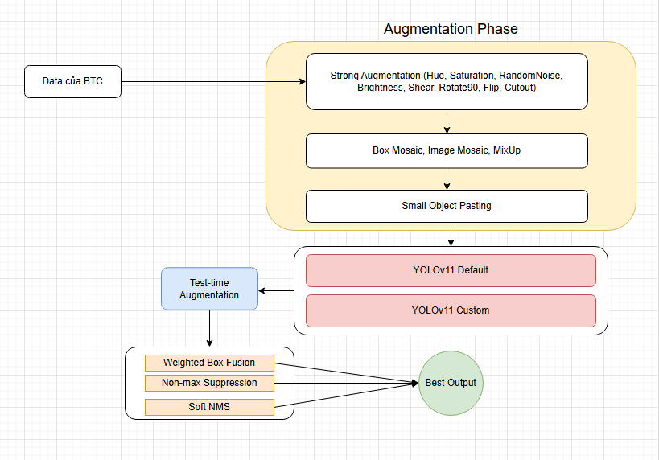

# Solution for track Traffic Vehicle Detection - SoICT Hackathon 2024

- My solution is depicted as the image below:




__IMPORTANT NOTES__: 
- Machine with GPU support is recommended.
- Source code was written and experimented on Kaggle platform, running on other environments may encounter errors. Please inform me for proper support and debugging.

- In order to generate synthetic dataset, please go to this link: https://www.kaggle.com/code/dangtop1/soict-hackathon-gendataset. All you need to do: click "Run All" (you can run cell-by-cell too) and wait for the generation process.

- Link training dataset: https://www.kaggle.com/datasets/dangtop4sure/dataset. Please ignore the "train_for_server" folder in this dataset. In order to know what to do next with the dataset after downloading, please go to the "data" folder (read DataStructure.txt file) to know all the details.

- __If the running process with docker encounters any errors, please contact me or go to this link https://www.kaggle.com/code/dangtop4sure/test-notebook/edit (to train or reproduce my result on kaggle)__.

## 0. Project Structure
- The high level structure of this project :
  - `data/`: training data are stored in this folder.
  - `test/`: public test are stored in this folder.
  - `src/infer` or `src/train`: neccessary bash scripts for inferencing and training on docker container can be found in this folder. These scripts are also used for training on Kaggle platform. 
  - `saved_models/`: weights for our trained models (_cus_model.pt_ and _def_model.pt_).
  - `ensemble`: this folder stores the ensemble bash script for ensembling results of my models and the _predict.txt_ file as the final result (after ensembling).
  - `prediction`: The outcoming prediction for each of the 2 models (_cus_predict.txt_ and _def_predict.txt_)

## 1. Environment Configuration

- After unzipping the compressed source code, run the following command to build docker image:
```bash
docker build -f Dockerfile -t dangdot .
```
- Run docker container with GPU:
```bash
docker run --gpus all -it --rm --name dangdot_container dangdot
```
- Run docker container without GPU:
```bash
docker run -it --rm --name dangdot_container dangdot
```

## 2. Model Training & Inference
### 2.1. Training
- Our two models are selected in [yolov10l, yolov11l-custom, yolov11l-default, rt-detr] after the trial experiments on two datasets (raw, synthesis).
- The final result is obtained by ensembling predictions of the 2 models.
- Run the below command to _train_ models individually and _predict_ outputs on public test. The outcoming prediction for each of models is contained in `prediction/` and weights of models are stored in `saved_models/`:  

- To train yolov11-custom, run the following command:
```bash
cd /app/src/train/yolov11
bash yolov11_custom.sh
```

- To train yolov11-default, run the following command:
```bash
cd /app/src/train/yolov11
bash yolov11_default.sh
```

#### 2.2. Inference

- To infer yolov11-custom, run the following command:
```bash
cd /app/src/infer/yolov11_custom
bash yolov11_custom.sh
```

- To infer yolov11-default, run the following command:
```bash
cd /app/src/infer/yolov11_default
bash yolov11_default.sh
```

- `def_predict.txt` and `cus_predict.txt` lies in the folder `prediction`, to get the final output, run the following command (After running this command, the final output `predict.txt` will be created inside `ensemble` folder):
```bash
cd /app/ensemble
bash ensemble.sh
```
